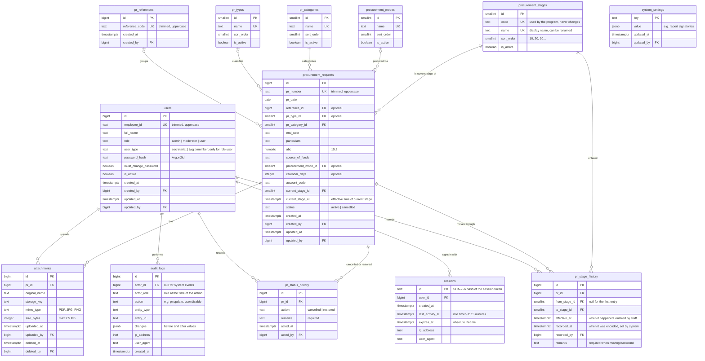

# Database Design

This document describes the PostgreSQL database of the Procurement Monitoring System (PMS): its tables, how they relate, and the rules the database enforces. The source of truth is the migration files in `db/migrations/`; this document explains them.

**Last updated:** September 27, 2026

---

## 1. Conventions

| Topic        | Convention                                                                                          | Example                             |
| ------------ | --------------------------------------------------------------------------------------------------- | ----------------------------------- |
| Table names  | snake_case, plural                                                                                  | `procurement_requests`              |
| Column names | snake_case                                                                                          | `pr_number`                         |
| Foreign keys | `<thing>_id`                                                                                        | `procurement_mode_id`               |
| Timestamps   | `<event>_at`, type `timestamptz`                                                                    | `created_at`, `effective_at`        |
| Booleans     | `is_` or `must_` prefix                                                                             | `is_active`, `must_change_password` |
| Primary keys | `bigint GENERATED ALWAYS AS IDENTITY`; `smallint` for small lookup tables                           | `id`                                |
| Text         | `text` with a `CHECK` on length where useful (in PostgreSQL, `text` and `varchar` perform the same) |                                     |
| Money        | `numeric(15,2)`, never floating point                                                               | `abc`                               |
| Constraints  | always named, `<table>_<column>_<rule>`                                                             | `users_role_valid`                  |

**Fixed value sets that the program depends on** (role, user type, PR status) are `text` columns with a `CHECK` constraint. These are easier to change in a migration than PostgreSQL `ENUM` types, which cannot easily have values removed.

**Lists that administrators may change** (stages, procurement modes, PR types) are lookup tables.

**Identifiers are normalized.** PR Number, Reference ID, and Employee ID are stored trimmed and uppercase. The database rejects values that are not, so duplicates such as `2026091231-a` and `2026091231-A` cannot exist.

**Nothing important is deleted.** Users are disabled (`is_active`), PRs are cancelled (`status`), lookup values are deactivated (`is_active`), and attachments are hidden (`deleted_at`).

**`updated_at` is maintained automatically** by a trigger (`set_updated_at`) on every table that has it. `created_by` and `updated_by` are set by the application.

## 2. Entity Relationship Diagram

For readability, the diagram omits the `created_by` / `updated_by` links from most tables to `users`.

## 3. Tables

| Table                  | Purpose                                                                    | Built in  |
| ---------------------- | -------------------------------------------------------------------------- | --------- |
| `users`                | Accounts, roles, user types, and password hashes.                          | Lesson 2A |
| `procurement_stages`   | The procurement stages, in order.                                          | Lesson 2A |
| `procurement_modes`    | Procurement modes.                                                         | Lesson 2A |
| `pr_types`             | Types of PR.                                                               | Lesson 2A |
| `pr_categories`        | PR categories (Office, Hospital, 7K / SEF).                                | Lesson 2A |
| `pr_references`        | Reference IDs used to consolidate several PRs.                             | Lesson 2B |
| `procurement_requests` | The PRs themselves.                                                        | Lesson 2B |
| `pr_stage_history`     | Every stage change: from, to, effective time, recorded time, who, remarks. | Lesson 2B |
| `pr_status_history`    | Every cancellation and restoration, with remarks.                          | Lesson 2B |
| `audit_logs`           | Record of important actions, with before and after values.                 | Lesson 2B |
| `sessions`             | Login sessions for idle and absolute timeouts.                             | Phase 3   |
| `attachments`          | Uploaded PR files.                                                         | Phase 7   |
| `system_settings`      | Configurable values such as report signatories.                            | Phase 7   |

## 4. Where each rule is enforced

Some rules can be enforced by the database directly; others need information the database does not have (such as who is logged in) and are enforced by the application's server code.

| Rule                                                                         | Enforced by                        |
| ---------------------------------------------------------------------------- | ---------------------------------- |
| PR Number, Reference ID, Employee ID unique and normalized                   | Database (`UNIQUE`, `CHECK`)       |
| Role and user type values valid; user type present only for regular users    | Database (`CHECK`)                 |
| ABC greater than zero; Calendar Days greater than zero                       | Database (`CHECK`)                 |
| PR status is `active` or `cancelled`                                         | Database (`CHECK`)                 |
| Stage effective time not after the recorded time (not in the future)         | Database (`CHECK`)                 |
| Cancel and restore remarks required                                          | Database (`NOT NULL`, `CHECK`)     |
| Attachment size at most 2.5 MB                                               | Database (`CHECK`) and application |
| Stage change and its history record saved together                           | Database transaction               |
| Remarks required when moving a PR backward                                   | Application                        |
| Effective time not earlier than the PR's latest stage entry                  | Application                        |
| Cancelled PRs cannot be edited or moved                                      | Application                        |
| Who may perform each action (permission matrix)                              | Application                        |
| An Admin cannot disable themselves; the last active Admin cannot be disabled | Application                        |
| Stage history, status history, and audit logs cannot be changed or deleted   | Database (append-only trigger); restricted database account in production |
| PRs cannot be deleted once they have history | Database (foreign keys)       |
| Free-text fields stored without leading or trailing spaces                   | Database (`CHECK`) and application |

## 5. Stage codes

The program refers to stages by `code`. Display names can be changed freely in the database without affecting the program.

| Order | Code                           | Name                         |
| ----- | ------------------------------ | ---------------------------- |
| 10    | `received`                     | Received                     |
| 20    | `pre_procurement`              | Pre-Procurement              |
| 30    | `posting`                      | Posting                      |
| 40    | `pre_bid`                      | Pre-Bid                      |
| 50    | `opening`                      | Opening                      |
| 60    | `evaluation`                   | Evaluation                   |
| 70    | `post_qualification`           | Post-Qualification           |
| 80    | `notice_of_post_qualification` | Notice of Post-Qualification |
| 90    | `notice_of_award`              | Notice of Award              |
| 100   | `notice_to_proceed`            | Notice to Proceed            |
| 110   | `completed`                    | Completed                    |

The gaps of 10 allow a new stage to be inserted between two existing stages (for example, order 55) without renumbering.

The delivery due date is calculated from the `notice_to_proceed` entry in `pr_stage_history` plus the PR's Calendar Days.
